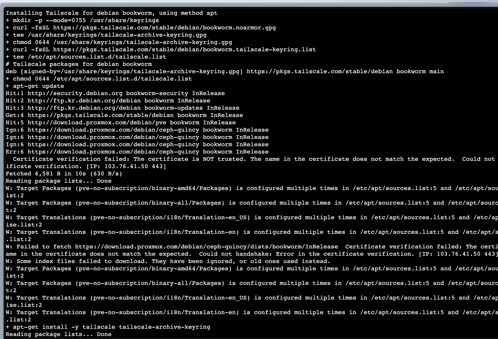
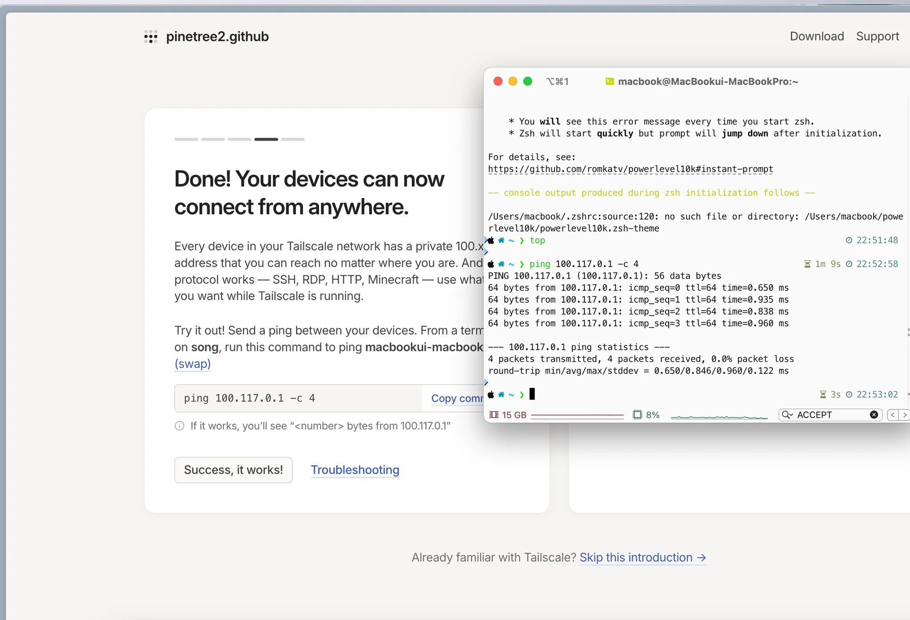
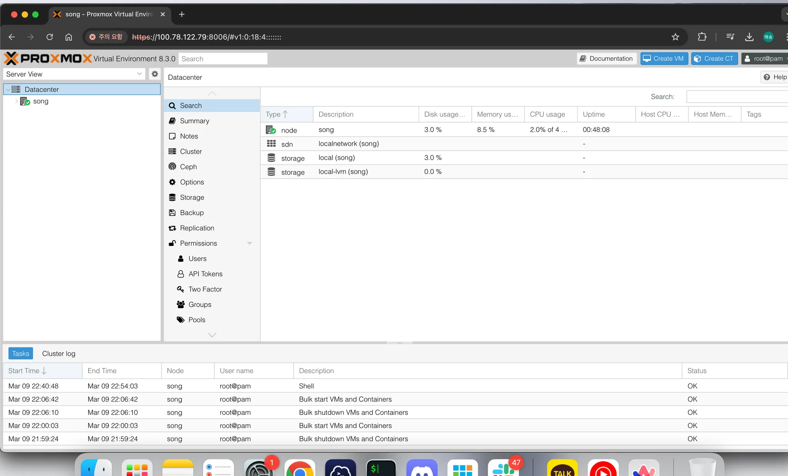
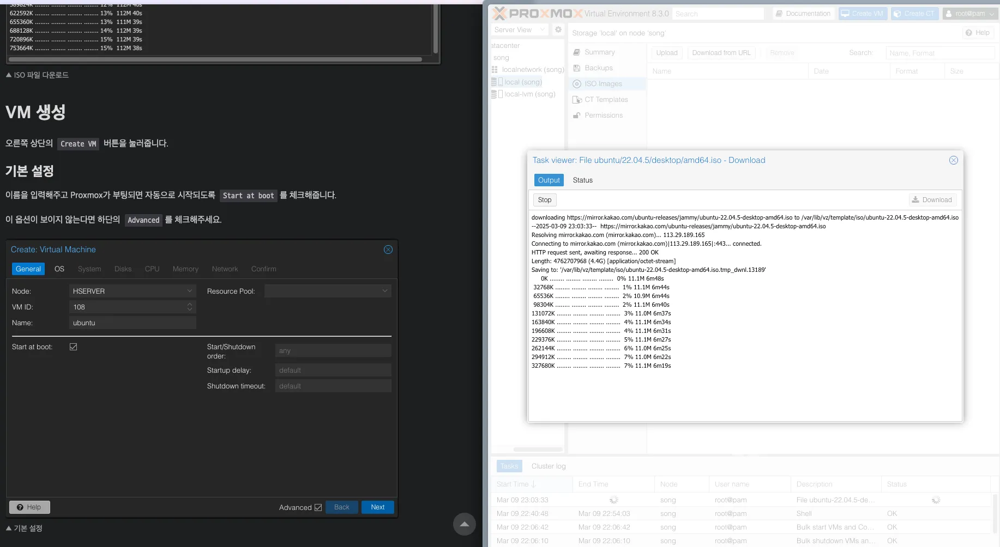
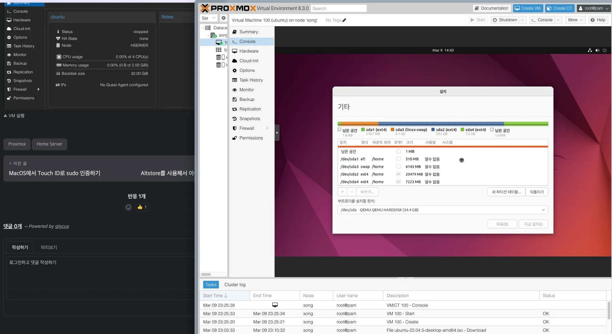

## #1 Proxmox 구성하기

기존에 이미 쓰던 서버 3개중에 하나를 걍 아예 갈아 엎었다.

갈아 엎는다 ? == OS 부팅을 다시한다..

그 OS 부팅을 이전처럼 우분투 생짜로 하는것이 아닌,
가상화 기술인 Proxmox 를 이용한다.

Proxmox 는 kvm 가상화 기술처럼 host os 없이, hypervisor 를 이용해서 바로 guest os 를 관리하는 것이다.

### 세팅하기
1. [발레나에처](https://etcher.balena.io/)를 이용해서 부팅 디스크를 만들었다.
이때, proxmox 부팅 이미지를 이용했다.

2. proxmox 초기 세팅 진행
병욱님의 [자료](https://cybecho.notion.site/Proxmox-029d1e143d554abc8b9a6e5da8468f09?pvs=4)를 참고했다.

3. Proxmox 초기 세팅 시 문제점 
희한하게, GUI접속이 크롬에서는 안되고, 아크에서는 되었다.
그래서 브라우저를 넘나들었는데
일시적인 오류인것같았다.

4. Tailscale 설치 ( 외부 접속 용도 [관리자기준] )  
Tailscale 설치 도중에, proxmox 패키지(?) 중 일부가 SSL 오류를 뿜었지만, 무시했다.

5. Tailscale 을 이용한 proxmox 접속 성공

6. 리눅스 vm 띄우기

- 파티셔닝

