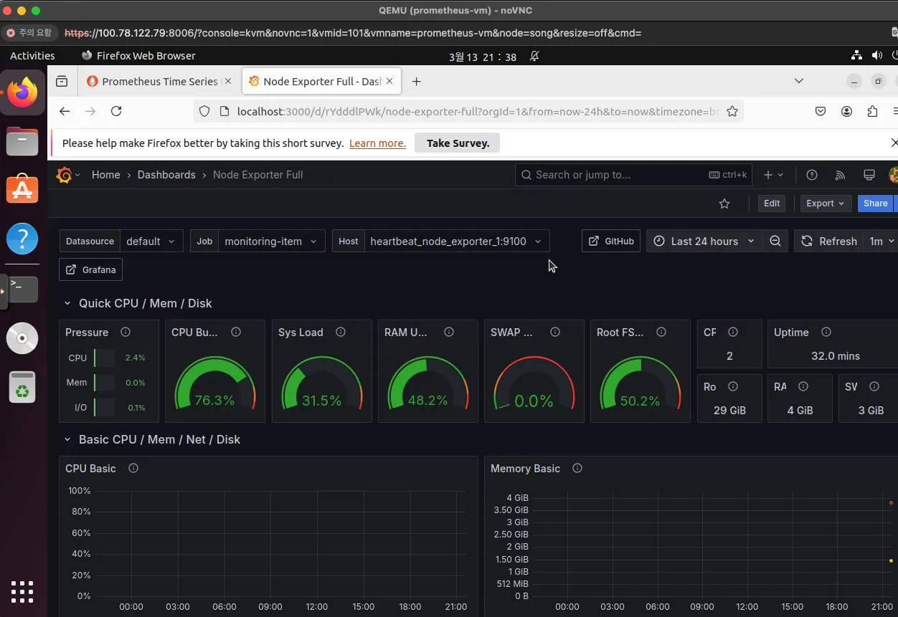
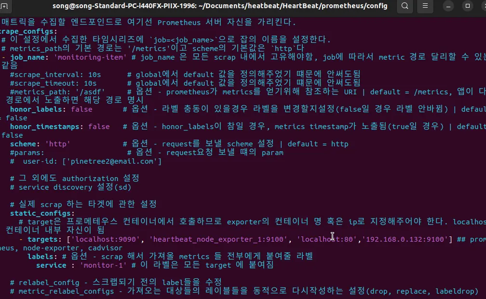
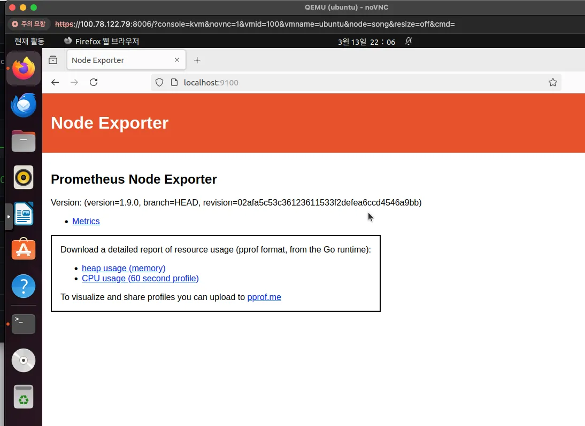
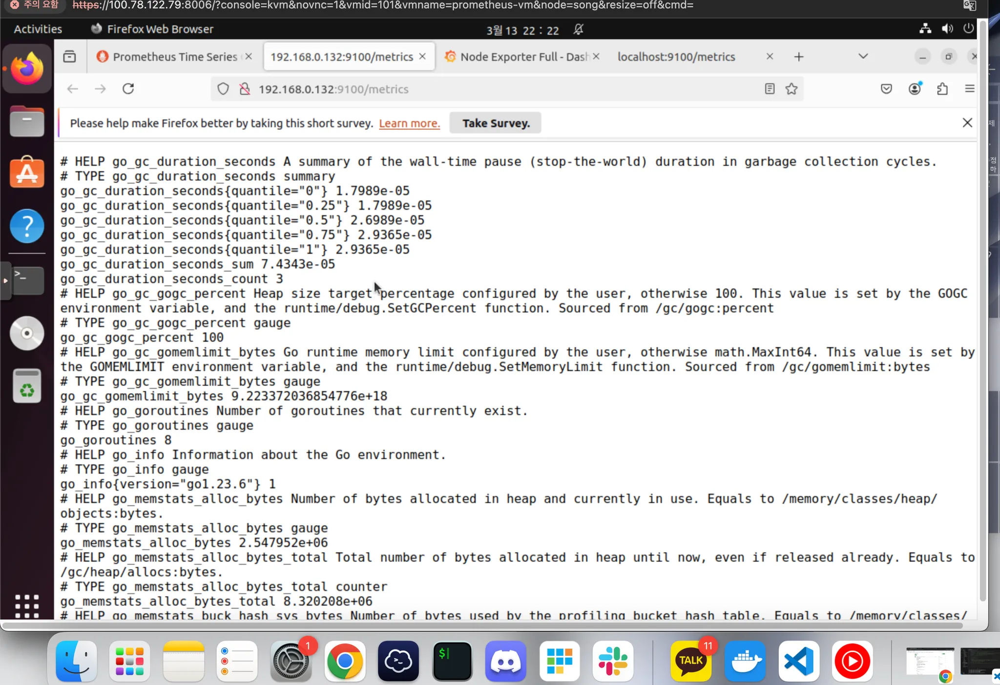
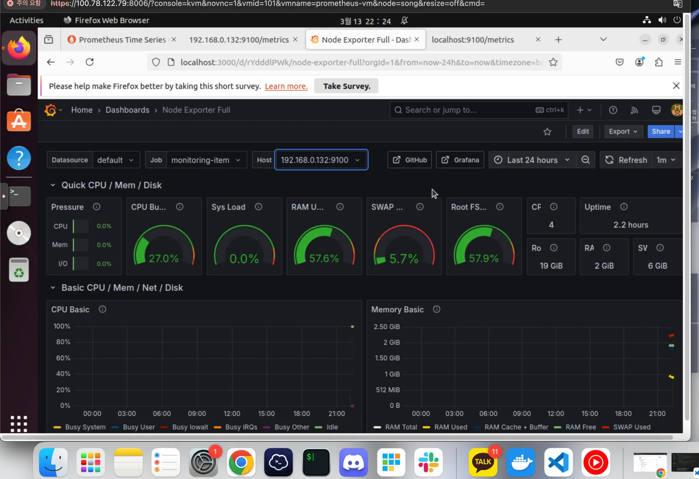
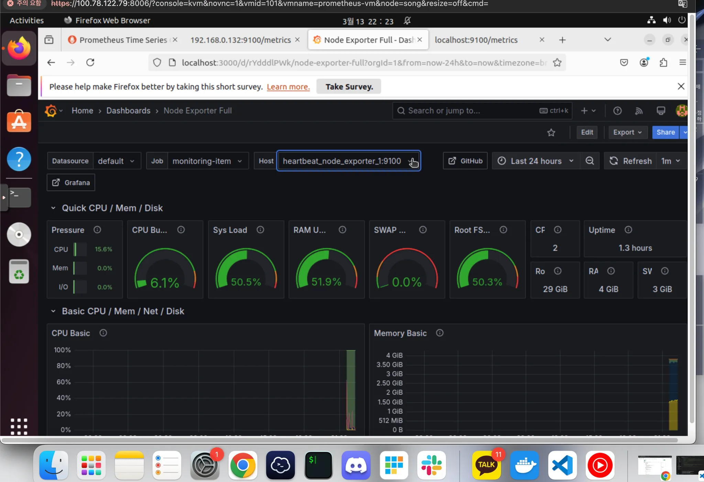

## #1 홈서버에 vm2개 만들어서 프로메테우스+그라파나 설치하고 모니터링하기 

홈서버에는 proxmox 로 가상화가 되어있고, vm을 여러개 띄울 수 있다.

현재는 하나의 ubuntu vm 만 구성된 상태이다.

> vm 1 ip : ( 수집 대상 ) : 192.168.0.132 <br> vm 2 ip : ( 수집용 ) : 192.168.0.167 

<br>

각종 기본 세팅을 해줬다.

- [sshd 설치](https://dirt-spoon.tistory.com/181) (vm 간에 명령어/통신이 필요할 때에 필요하니까)
- 호스트파일에도 별칭 지정해둠.
- vim도 설치해둠
- 사소한 이슈이긴 한데,, proxmox vm 의 콘솔에서는 cmd+v 가 안됨..
    - 그래서 proxmox 콘솔에서 ssh 접속해서 붙여넣기 함


vm 2 에 설치해뒀다


```
version: '3.7'  # 파일 규격 버전
services:       # 이 항목 밑에 실행하려는 컨테이너 들을 정의
  prometheus:
    image: prom/prometheus:latest
    user: "0:0"
    container_name: prometheus
    volumes:
      - ./prometheus/config:/etc/prometheus
      - ./prometheus/volume:/prometheus
    ports:
      - 9090:9090 # 접근 포트 설정 (컨테이너 외부:컨테이너 내부)
    command: # web.enalbe-lifecycle은 api 재시작없이 설정파일들을 reload 할 수 있게 해줌
      - '--web.enable-lifecycle'
      - '--config.file=/etc/prometheus/prometheus.yaml'
    restart: always
    networks:
      - promnet

  grafana:
    image: grafana/grafana:latest
    container_name: grafana
    user: "0:0"
    ports:
      - 3000:3000 # 접근 포트 설정 (컨테이너 외부:컨테이너 내부)
    volumes:
      - ./grafana/volume:/var/lib/grafana
      - ./grafana/dashboards:/var/lib/grafana/dashboards    # 대시보드 지정
      - ./grafana/provisioning:/etc/grafana/provisioning    # 지정한 대시보드 불러오기 및 프로메테우스 uid 고정(충돌방지)
      - GF_SECURITY_ADMIN_PASSWORD=admin  # 초기 비밀번호 지정
    restart: always
    networks:
      - promnet

  node_exporter:
    image: prom/node-exporter:latest
    volumes:
      - /proc:/host/proc:ro
      - /sys:/host/sys:ro
      - /:/rootfs:ro
    command:
      - '--path.procfs=/host/proc'
      - '--path.rootfs=/rootfs'
      - '--path.sysfs=/host/sys'
      - '--collector.filesystem.mount-points-exclude=^/(sys|proc|dev|host|etc)($$|/)'
    ports:
      - "9100:9100"
    networks:
      - promnet

networks:
  promnet:
    driver: bridge


```

이 docker-compose.yml 에서 prometheus config파일 위치를 확인


프로메테우스.yml 파일에서 수집 대상에 vm-1아이피를 추가해준다.



vm1에 node-exporter설치함



### **✅ 2. 다른 VM에 Node Exporter 설치**

다른 VM에서 **Node Exporter**를 설치하면 Prometheus가 해당 VM의 메트릭을 수집할 수 있어!

### **1️⃣ Node Exporter 다운로드 & 실행**

```bash
bash
복사편집
wget https://github.com/prometheus/node_exporter/releases/latest/download/node_exporter-*.linux-amd64.tar.gz
tar xvf node_exporter-*.linux-amd64.tar.gz
cd node_exporter-*.linux-amd64
sudo ./node_exporter --web.listen-address="0.0.0.0:9100" &

```

✅ **이제 `http://<다른VM_IP>:9100/metrics` 에서 확인 가능!**

### **2️⃣ 시스템 서비스 등록 (자동 실행)**

```bash

sudo nano /etc/systemd/system/node_exporter.service
```

파일 내용:

```

[Unit]
Description=Node Exporter
After=network.target

[Service]
User=root
ExecStart=/home/song/node_exporter-*.linux-amd64/node_exporter --web.listen-address="0.0.0.0:9100"
Restart=always

[Install]
WantedBy=multi-user.target

```

**서비스 등록 및 실행:**

```bash

sudo systemctl daemon-reload
sudo systemctl enable node_exporter
sudo systemctl start node_exporter

```

vm2 에서도 vm1의 노드익스포터 결과를  확인가능함


vm1 의 node_exporter리소스 수집 확인 가능 (그라파나에 호스트 추가)


vm2 vm 자체 노드 익스포터 (도커 컨테이너)수집 결과


### #2. 외부접속

- tailscale acl 외부 사용자 접속 가능한
    - 제 pc가 아닌 다른 팀원의 pc 즉, 외부에서 제 홈서버 proxmox위의 vm의 메트릭을 수집하고싶을 경우에
    tailscale vpn 을 등록한 팀원의 기기에 설치된 프로메테우스 config 파일에 스크랩 대상으로 홈서버 ip(vpn ip)자체 를 등록할 수 있다는 알겠지만
    vm 별 ip는 어떻게 접근해야할지?
    - https://chatgpt.com/share/67d6676e-53c8-800e-844a-44aaa94cf2a8
    - 그냥 생각한대로, tailscale 에 기기 등록해두고 접속 가능할듯? 
- 그 외 ) tailscale auth 키 등록해서 브라우저 로그인 없이도 가능하게 할 수 있다.