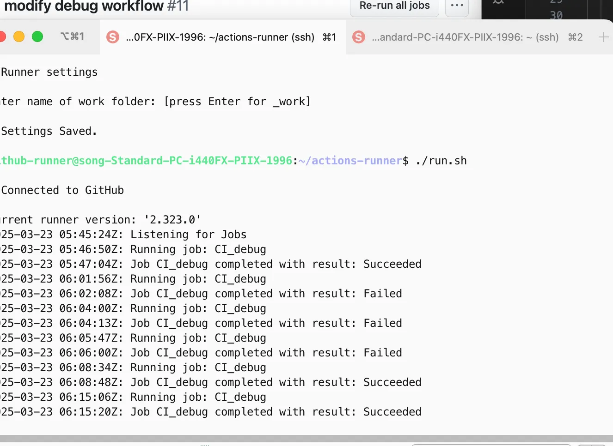

## # 3주차 : Github Actions 와 Action Runner 로 서버 자동화 작업 맛보기

### 1. 개념 정리

#### 1) Github Actions & Runner 란?
**Github Actions**는 코드 변경 사항을 감지하고 자동으로 빌드, 테스트, 배포 등을 수행할 수 있도록 도와주는 **CI/CD 도구**입니다. GitHub 저장소에 직접 통합되어 있으며, YAML 형식의 워크플로우 파일을 통해 작업을 정의할 수 있습니다.

**Self-Hosted Runner**는 Github Actions를 실행하는 머신을 사용자가 직접 운영할 수 있도록 하는 기능입니다. 기본적으로 Github에서 제공하는 클라우드 Runner가 있지만, 비용 절감 및 온프레미스 환경의 맞춤형 CI/CD를 위해 Self-Hosted Runner를 사용할 수 있습니다.

#### 2) Github Actions 를 우리가 사용해야 하는 이유
Github Actions를 활용하는 주요 이유는 다음과 같습니다:

- **자동화**: 코드 변경 시 빌드, 테스트, 배포 등의 작업을 자동화하여 개발 속도를 높일 수 있음.
- **커스텀 환경 지원**: 온프레미스 서버에 맞춰 Runner를 직접 설치하고 실행할 수 있음.
- **확장성**: 다양한 오픈소스 및 사설 액션을 활용하여 CI/CD 파이프라인을 쉽게 확장할 수 있음.
- **유연한 트리거**: `push`, `pull_request`, `schedule`, `workflow_dispatch` 등 다양한 트리거 조건을 지원함.
- **보안 및 비용 절감**: 자체 서버에서 실행함으로써 클라우드 Runner 사용에 따른 비용을 줄이고, 보안 요구사항을 충족할 수 있음.

### 2. Hands-On

#### 1) Github Actions Workflow 설명
아래는 Self-Hosted Runner를 활용한 Github Actions Workflow 예제입니다:

```yaml
name: Debug Workflow

on:
  workflow_dispatch:
    inputs:
      branch:
        description: 'Branch name'
        required: true
        default: 'main'
  push:
    branches:
      - 'week/#3'
      - 'main'

jobs:
  CI_debug:
    runs-on: self-hosted
    steps:
      - name: Template
        run: |
          echo "Hello, World!"
          echo "This is a device running on ${{ runner.os }}"
          echo "This is a device running on ${{ runner.arch }}"
          echo "This device's architecture is $(dpkg --print-architecture)"
      
      - name: Check Docker version
        id: docker_version
        run: |
          docker --version
        continue-on-error: true
      
      - name: Install Docker (if failed)
        run: |
          curl -fsSL https://get.docker.com | sh
      
      - name: Checkout
        uses: actions/checkout@v2
```

#### 2) Workflow 분석
- `on` 섹션: 워크플로우가 실행되는 트리거 조건을 정의 (`push`, `workflow_dispatch` 지원).
- `runs-on: self-hosted`: 자체 호스팅한 Runner에서 실행.
- `Template`: OS 및 아키텍처 정보 출력.
- `Check Docker version`: Docker 설치 여부 확인.
- `Install Docker (if failed)`: Docker가 없을 경우 자동 설치.
- `Checkout`: 저장소 코드를 가져와 다음 단계에서 사용할 수 있도록 설정.

### 3. SSH 및 Secretive 활용
#### 1) Github 연결을 위한 SSH 설정
Github에 연결하기 위해 SSH 작업을 수행하였습니다. 다음 명령어를 실행하여 SSH 연결을 확인할 수 있습니다:
```sh
ssh git@github.com
```
이때, Github의 Public Key를 이용해야 하는데, 애플 실리콘 칩(M1/M2)은 **Secure Enclave**를 이용하여 SSH 인증을 수행합니다. 이를 위해 [**Secretive**](https://github.com/maxgoedjen/secretive)라는 툴을 사용했습니다.

#### 2) Secretive 사용 시 SSH Proxy 설정
Secretive를 이용하기 위해 `.ssh/config` 파일에서 `ForwardAgent` 설정을 활성화해야 합니다. 온프렘 환경에서 Proxmox -> VM 서버로 SSH 접근을 해야 하는 경우, 두 번의 SSH 연결이 필요해 번거로울 수 있습니다. 이를 해결하기 위해 **SSH ProxyJump**를 활용하면 내부 VM으로 직접 접속이 가능합니다.

`.ssh/config` 파일 설정 예제:
```ini
Host *
  IdentityAgent {secretive pub key}

Host proxmox
  HostName {tailscale 네트워크 인터페이스 ip}
  User hong

Host proxmox-ubuntu 
  HostName {vm ip}
  User hong
  ProxyJump proxmox
```
위 설정을 적용하면 `ssh proxmox-ubuntu` 명령을 실행할 때 **Proxmox를 거쳐 VM에 자동으로 접속**할 수 있습니다. VM에 Tailscale을 설치하는 번거로움을 줄이고, Secretive를 두 번 입력하는 방식으로 보안성을 유지하면서도 쉽게 접근할 수 있습니다.

### 4. 결론
이 Github Actions 워크플로우는 **Self-Hosted Runner를 활용한 CI/CD 자동화 환경**을 구축하는 방법을 보여줍니다.


실제 Runner 가 동작하는 화면


- 온프레미스 서버에서 CI 작업을 수행할 수 있도록 설정.
- Docker 미설치 시 자동 설치 기능 추가.
- `push` 또는 `workflow_dispatch` 이벤트 발생 시 워크플로우가 실행됨.
- Actions Runner를 활용하여 맞춤형 CI 환경을 구축하고 확장할 수 있음.
- **SSH ProxyJump** 설정을 통해 온프레미스 가상화 환경에서 SSH 접근을 간편하게 할 수 있음.

이러한 방식을 적용하면, 조직 내에서 **온프레미스 CI/CD 환경을 효과적으로 운영할 수 있으며, 보안 및 비용 절감의 이점을 누릴 수 있습니다.**

