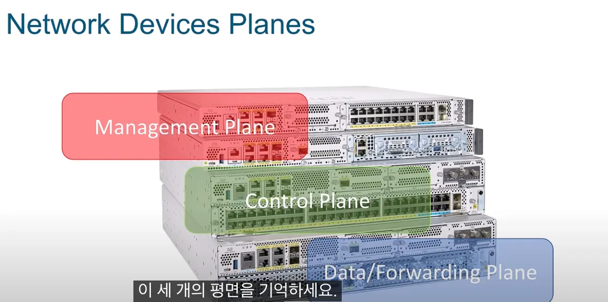

# 0. 들어가기 전에,,

SDN 이 무엇인지 알기 전에 현재 환경 점검부터 했다.

Proxmox VE 6.2부터 SDN 기능을 사용할 수 있지만, 안정적이고 완전한 기능을 활용하려면 Proxmox VE 8.1 이상의 버전을 사용하는 것이 좋다.

[docs 에서 확인할 수 있다. ](https://pve.proxmox.com/pve-docs/chapter-pvesdn.html)


그리고, 주로 [이 글](https://svrforum.com/svr/1988206)과 gpt를 참고 및 발췌해서 작성 + 구축을 진행했기 때문에 어투가 일정하지 않을 수 있다!

# 1. 전통적인 장비의 네트워크 구조


위 **[그림 2]** 와 같이 전통적인 네트워크 장비의 내부 구조는 크게

**제어평면(Control Plane), 데이터평면(Data Plane)** 으로 구분한다.(물론 두 Plane사이 동작 및 성능 관리를 담당하는 Management Plane도 있으나 여기서는 생략한다.)

**제어평면은 패킷 제어, 데이터평면은 패킷 전송을**

담당하며 하나의 네트워크 장비를 구성한다. 예를 들어 네트워크 장비 내부로 데이터 패킷이 들어오면 제어평면은 해당 패킷 헤더에 포함된 Src/Dst IP나 MAC 정보등을 고려하여 해당 패킷을 어떤 포트로 내보 낼지 결정한다. 데이터 평면은 제어평면에서 결정한 내용을 가지고 미리 설정된 링크의 대역폭(QoS), VLAN 설정(Push/Pop) 기능을 수행하며 패킷을 출력포트로 내보낸다.

## 1.1 Proxmox 기본 네트워크 = ?

### 전통적인 브리지 방식

Proxmox를 설치하면 일반적으로 다음과 같은 방식으로 네트워크가 설정돼요:

```

vmbr0 = 브리지 (bridge)
 ↳ 실제 NIC (예: enp3s0) 와 연결
 ↳ VM들이 이 브리지를 통해 외부와 통신
```

### 🔧 특징:

- **OS 수준에서 설정** (`/etc/network/interfaces`)
- `bridge`, `bonding`, `VLAN` 정도는 구성 가능
- **노드 단위**로 구성됨 → **멀티 노드 환경에서 네트워크 자동 연동 어려움**
- 수동 설정이 많고 자동화에 한계 있음

## 1.2 Proxmox Bridge 에 비한 장점

### **1) DHCP IPAM (IP Address Manager)으로 주소 자동 할당 및 관리**

IPAM (IP Address Manager) 기능은 SDN 인프라 기능의 가장 대표적인 장점이며, 특정 VNet에 사용자가 원하는 서브넷으로 DHCP 서버를 실행하고 주소 할당 범위를 지정할 수 있습니다.

또한 현재 클러스터에 존재하는 영역과 VNet, 서브넷을 구분하여 게스트에 할당된 주소 목록을 트리 뷰로 제공하므로 높은 시인성을 제공하며, 아래와 같이 게스트에 할당된 DHCP 임대 주소를 직접 편집할 수도 있습니다.

### **2) Datacenter 단위의 중앙 집중식 관제**

Proxmox SDN 기능은 단일 노드에서도 충분히 효과적인 기능이지만, 여러 노드가 결합된 클러스터 단위에서 가장 높은 편의성을 제공합니다.

기존 방식으로 같은 목적의 브리지를 각 노드마다 하나씩 설정하는건 매우 번거롭고 헷갈릴 뿐만 아니라, 해당 설정을 확인하려면 역시 각각의 노드마다 네트워크 설정에서 확인해야 합니다.

또한 각 게스트에 DHCP로 주소를 자동 할당하고 싶다면 각 노드마다 DHCP 서버를 별도로 두거나 호스트 콘솔을 통해 직접 dnsmasq 서버를 구축·관리해야므로 대단히 비효율적입니다.

Simple Zone 역시 각 노드 단위로 생성/동작하는 것은 동일하지만, 아래 이미지와 같이 모든 설정은 각 노드마다 일일이 설정하는게 아니라 Datacenter 단위에서 일괄적으로 이뤄집니다.


예를 들어 특정 노드에 특정 영역을 생성할지 여부는 속성 창에서 단순히 클릭 몇 번으로 변경할 수 있으며, 언제든지 유연하게 추가시키거나 제외시킬 수 있습니다.

### 3) **노드 내에서 복수의 VNet 및 서브넷으로 라우팅 가능**

이는 Simple Zone으로 3계층 도메인을 구현하여 얻는 가장 큰 이익입니다.

일반적으로 각각 다른 서브넷에 속한 게스트가 서로 통신하려면 라우팅 주체가 필요하고, PVE 호스트의 라우팅 테이블에 이를 추가해야하므로 번거로운 일입니다.

이와 달리, Simple Zone으로 구분된 영역은 이미 각 서브넷 게이트웨이에서 공통된 라우팅 테이블을 가지므로 올바르게 영역을 생성하고, VNet으로 서브넷을 추가해두면 별도 추가 작업 없이 같은 Zone 내에서 타 서브넷으로 라우팅할 수 있습니다.

# 2. 정의 ( **What is Software-Defined Networking (SDN)? )**


전통적인 네트워킹은 통합 하드웨어와 소프트웨어를 사용해 여러 라우터와 스위치에 트래픽을 보냈습니다.

SDN 은 네트워크를 관리하는 제어 영역과 트래픽이 통과하는 데이터 영역을 분리해 네트워크를 가상화 합니다.

SDN은 트래픽을 어디로 전송할지 결정하는 제어 플레인을 소프트웨어로 이동시키고, 실제로 트래픽을 전달하는 데이터 플레인은 하드웨어에 남겨둡니다.

이를 통해 소프트웨어 정의 네트워킹을 사용하는 네트워크 관리자는 장치별로 관리하는 대신 단일 창을 통해 전체 네트워크를 프로그래밍하고 제어할 수 있습니다.

**하나의 집중화된 제어평면**이 하위 (데이터평면의 역할을 수행하는) 네트워크 장비를 관제 하는 중앙집중식 네트워크 형태를 의미한다.<br> 
이런 네트워크 형태는 중앙 컨트롤 
타워에서 여러 스위치들의 관제 및 제어가 가능하기 때문에, 네트워크 관리자가 스위치 하나하나에 직접 붙어서 관리해줄 필요가 없다. <br>그만큼 관리의 효율성이 증대된다. 여기서 상위에 위치한 제어평면을 **SDN 제어기**라고 부르며, 단일 물리/가상 서버로 구성될 수 있다.<br> **하위 네트워크 장비**는 보통 **SDN 스위치**라고 부르며 물리/가상 스위치를 모두 포함한다.

**SDN 제어기와 스위치 사이의 인터페이스(Southbound Interface) 규격**은 프로토콜로 정의되어 있으며  **OpenFlow, NetConf, OVSDB** 등이 있다. 해당 인터페이스 규격은 SDN 스위치 혹은 SDN 제어기마다 다르며 OpenFlow, NetConf, OVSDB 등 모두 지원하거나 일부만 지원할 수도 있다.


SDN을 사용하면 관리자가 하드웨어를 추가하지 않고도 중앙 집중식 사용자 인터페이스를 통해 네트워크를 제어하고, 구성 설정을 변경하고, 리소스를 프로비저닝하고, 네트워크 용량을 늘릴 수 있습니다.

벤더사가 다른 스위치들의 경우, 일일이 스위치에 접속해서 config 를 바꿔줘야 합니다.

L3 레이어에 있는 장비라면, 라우팅이라는 행위를 할건데

그에 대한 핸들링을 일일이 다 해줘야 하기 때문에 , 스위치가 많은 환경에서는 적합하지 않기에 이를 개선하고자 나온 개념이 SDN 입니다.

이는 마치 거대한 하나의 스위치처럼 동작하게 되는것입니다.

이 때 각 스위치들의 통신을 위한 네트워크 구성을 Underlay Network, 해당 스위치를 통해서 각 단말들의 통신이 이루어지는 네트워크 구성을 Overlay Network라고 칭합니다.

네트워크를 가상화 하면, 동적으로 네트워크를 축소 및 확장할 수 있고, 특정 어플리케이션 사용례에 맞춰 세밀하게 조정해 최적화 할 수 있으며 개별 네트워크에 보안 정책을 적용할 수 있습니다.

그 외의 장점으로는

- 네트워크 장비 기능을 소프트웨어로 수정할 수 있다.
- 자체적으로 빠른 대응이 가능하다.
- 기능 수정을 통해 트래픽 비용을 절감할 수 있다.
- 제조사 의존도를 낮출 수 있다.



SDN의 3계층에 대해 설명하는 영상 캡 


app → sdn controller ( rest api)

openflow api 로 통신하는건 sdn → infra

음 ~그렇구나 

## 2.1 TGW 가 SDN에서 착안된 기술일까?

찾아보기전 나의 추측 : sdn 은 네트워크 관리의 기능을 소프트웨어 화 해서 하나로 중앙 집중하는 형식이고

tgw 는 aws 의 vpc (virtual private cloud) 를 연결하고 라우팅 하는 기능이기 때문에

‘중앙 집중’ 적으로 vpc 들을 ‘관리(라우팅 등)’ 한다는 측면에서는 비슷한 개념이 맞을것 같지만 

완전히 SDN의 개념을 가져왔다고 보기는 어려울 것 같다.

찾아본 결과 )

🔄 SDN과 TGW의 유사한 점

| 항목 | SDN | TGW | 공통점 |
| --- | --- | --- | --- |
| 🧠 중앙 제어 | SDN Controller가 네트워크 흐름을 제어 | TGW가 VPC 간 트래픽을 라우팅 | **중앙 집중식 네트워크 관리** |
| 🌐 네트워크 연결 | VM/LXC 간 네트워크를 논리적으로 연결 | 여러 VPC/온프레미스를 연결 | **네트워크 연결 허브 역할** |
| 📦 정책 기반 제어 | ACL, Flow 정책으로 제어 | 라우팅 테이블, attachment 설정 | **정책 기반 트래픽 제어** |
| 🧱 추상화 | 물리 네트워크를 가상화 | 여러 네트워크를 논리적으로 연결 | **네트워크 추상화/논리화** |
| 🔀 트래픽 흐름 제어 | 흐름 제어(Flow Control) 가능 | 중앙 라우팅으로 트래픽 경로 지정 | **트래픽 흐름 제어 기능** |
| ⚙️ 자동화 가능 | API로 네트워크 동적 구성 | IaC (Terraform 등)로 자동화 | **자동화/프로그래머블 제어** |

🧠 핵심 요약

> SDN은 내부 네트워크를 프로그래밍 가능하고 유연하게 구성하는 기술이고,
> 
> 
> **TGW**는 여러 네트워크(VPC, 온프레미스)를 **중앙에서 연결하고 제어하는 허브**에 가까워요.
> 

두 기술 모두 **중앙 집중식 제어**, **정책 기반 트래픽 관리**, **유연한 네트워크 구성**이라는 점에서 유사합니다.

## 2.2 유사한 기술들

 이 네 가지는 모두 **소프트웨어 정의(Software Defined)** 개념으로, 기존 **하드웨어 중심의 인프라**를 **소프트웨어로 제어하고 자동화**하려는 흐름에서 나왔다고 한다. 

---

🔷 1. **SDN (Software-Defined Networking)**

> 네트워크를 소프트웨어로 제어하는 기술
> 
- **전통적인 스위치, 라우터의 제어기능(Control Plane)을 분리**해서 중앙에서 제어
- **네트워크 흐름을 중앙 컨트롤러가 통제**하고, 스위치는 데이터 전달만 수행
- 예: **OpenFlow, VXLAN, EVPN**, Proxmox SDN, Cisco ACI

🧠 핵심: **네트워크도 프로그래밍처럼 자동화하고 제어하자!**

---

🔷 2. **SDS (Software-Defined Storage)**

> 스토리지를 소프트웨어로 제어/관리하는 기술
> 
- 기존에는 스토리지가 **스토리지 장비마다 관리됨**
- SDS는 **일반적인 서버 디스크도 묶어서 하나의 큰 저장소처럼 구성** 가능
- 예: **Ceph, GlusterFS, vSAN**

🧠 핵심: **스토리지를 하드웨어에 종속시키지 말고, 소프트웨어로 유연하게 구성하자!**

---

🔷 3. **SDC (Software-Defined Compute)**

> 컴퓨팅 리소스(CPU, 메모리 등)를 가상화/소프트웨어로 제어
> 
- 전통적인 방식은 물리 서버에 직접 OS 설치
- SDC는 **하이퍼바이저를 통해 VM/컨테이너로 컴퓨팅 자원을 유연하게 할당**
- 예: **KVM, ESXi, Hyper-V, Proxmox VE, Kubernetes 노드 스케줄링 등**

🧠 핵심: **CPU와 메모리도 소프트웨어로 자동 배분하자!**

---

🔷 4. **SDDC (Software-Defined Data Center)**

> 위의 SDN + SDS + SDC를 모두 통합한 개념
> 
- 네트워크, 스토리지, 컴퓨트 모든 인프라를 **소프트웨어 중심으로 운영**
- 데이터센터 전체를 소프트웨어로 제어, **클릭 몇 번으로 VM, 네트워크, 디스크 할당**
- 예: **VMware vSphere + NSX + vSAN**, OpenStack, Proxmox 클러스터

🧠 핵심:

> 모든 인프라를 소프트웨어로 추상화해서,
> 
> 
> **자동화된 클라우드 환경처럼 작동하는 데이터센터** 만들기!
> 

---

## 📊 요약 정리표

| 용어 | 의미 | 대표 기술 |
| --- | --- | --- |
| **SDN** | 네트워크 제어 소프트웨어화 | OpenFlow, Proxmox SDN |
| **SDS** | 스토리지 자원 소프트웨어화 | Ceph, vSAN |
| **SDC** | 컴퓨팅 자원 가상화/제어 | KVM, Hyper-V |
| **SDDC** | 전체 인프라 소프트웨어화 | VMware SDDC, OpenStack |

---

## 2.3 비슷하지는 않지만 말나온김에 알면 좋은 개념 ( HCI )

| 항목 | HCI | SDN |
| --- | --- | --- |
| 💡 개념 | 컴퓨팅 + 스토리지 + 네트워크를 하나의 시스템에 통합 | 네트워크를 소프트웨어로 제어하는 기술 |
| 📦 구성 요소 | 서버 + 디스크 + 가상화 소프트웨어 통합 | SDN 컨트롤러, 스위치, VXLAN 등 |
| 🧠 목적 | 데이터센터 인프라 통합, 구축 단순화 | 네트워크 제어 자동화 및 가상화 |
| 💬 예 | Nutanix, VMware vSAN, Proxmox | OpenFlow, Cisco ACI, Proxmox SDN |

🔧 Proxmox + Ceph + SDN 아키텍처 구성 예시

```
                    +-------------------------------+
                    |        Proxmox Cluster        |
                    |  (SDDC / HCI Infrastructure)  |
                    +-------------------------------+
                       |         |         |
             +---------+---------+---------+---------+
             |                   |                   |
         Node 1              Node 2              Node 3
     (Proxmox + Ceph)    (Proxmox + Ceph)    (Proxmox + Ceph)
         |     |              |     |             |     |
         |   VM/CT           |   VM/CT           |   VM/CT
         |                   |                   |
     [Local NIC]         [Local NIC]         [Local NIC]
         |                   |                   |
         +-------- SDN Zone (VXLAN / VLAN) --------+
                          |
                  [Overlay 네트워크]
                          |
                     [물리 스위치]

```

- 🧠 **Proxmox**: 컴퓨트 (VM/CT), SDN 관리, Ceph 통합
- 💾 **Ceph**: 내부에서 자체 분산 스토리지 제공 (스토리지 노드 따로 필요 없음)
- 🌐 **SDN**: VM 간 격리된 네트워크 제공 (VLAN, VXLAN)
- 📡 **한 대 추가 = 스토리지 + 컴퓨트 + 네트워크 모두 확장**

요런식으로도 활용이 가능하다. ceph 가 분산 스토리지(SDS) 니까! 

# 3. Proxmox 로 SDN을 구성하기 위해 알아야 하는 것들!

## 3.1 Proxmox 기본 브릿지 네트워크에 비해 SDN 쓸만한 이유

### 🎯 목적:

- **클러스터 전체에서 네트워크 정책 일관성 유지**
- **VM 간 VXLAN 기반 통신 (오버레이 네트워크)**
- **네트워크 분리, 격리, 보안 그룹 적용 가능**
- **SDN Zone / VLAN / VXLAN / Controller 기반 구성**

### 🧠 예를 들어:

- SDN Zone: `vxlan100` → VM끼리 VXLAN으로 연결됨 (물리망 상관 없이)
- SDN Controller: 네트워크 상태를 관리 (예: `evpn` 연동)

## **3.2 Proxmox SDN 구성 요소**

Proxmox SDN is a new feature in Proxmox VE that allows you to create virtualized networks and isolated private network configurations in code. Think of it like creating your own little switch in software. These network are made up of virtual zones and networks (VNets) for communication. Using SDN, admins have much better control over networking management and virtual networks that are attached to VM guests and it is all free and open-source.

Note the following components of [Proxmox software-defined network](https://www.virtualizationhowto.com/2023/11/proxmox-8-1-new-features-and-download-with-sdn-secure-boot-and-new-notification-system/):

- **Zones** – a virtually separated network configuration or area. 가상으로 분리된 네트워크 구역으로, Simple, VLAN, QinQ, VXLAN, EVPN(BGP EVPN) 등 다양한 유형이 있습니다
    
    
    | SDN Zone 유형 | 다중 노드 필요? | 설명 |
    | --- | --- | --- |
    | **Simple Zone** | ❌ 단일 노드 OK | VM/LXC 간 네트워크 분리용. 외부 격리도 가능 |
    | **VXLAN Zone** | ✅ 다중 노드 필요 | 노드 간 L2 터널링. VM이 서로 다른 노드에 있을 때 사용 |
    | **EVPN Zone** | ✅ 다중 노드 + BGP 필요 | 고급 라우팅. 대규모 네트워크용 |
- [**Virtual networks](https://www.virtualizationhowto.com/2019/10/vmware-network-virtualization-components-and-products/) (VNets)** – Virtual network that is part of a zone. Zone에 속하는 가상 네트워크로, VM과 컨테이너가 통신하는 데 사용됩니다
- **Subnets** – The network IP space insde a VNet. VNet 내의 IP 주소 범위로, DHCP 설정을 통해 자동으로 IP 주소를 할당할 수 있습니다

**Proxmox SDN과 비슷한 솔루션**

[VMware NSX](https://www.virtualizationhowto.com/2016/07/vmware-nsx-domain-conflict-with-1-existing-domain/) : 유료라서 아무래도 얘가 더 좋음. 

- [참고] 클러스터 환경을 위한 SDN 기능
    
    SDN 컨트롤러 코어는 특정 노드에 의존적이지 않으며, 클러스터를 구성하는 모든 노드에서 동등하게 존재합니다.
    
    따라서 특정 노드에 시스템 장애가 발생하여 쿼럼을 잃더라도 나머지 노드의 SDN 기능 및 설정은 지속됩니다.
    
    이는 기존의 각 호스트 수준 네트워크에 기반한 브리지 인터페이스와 커다란 차이를 가지며, 특정 인터페이스에 바인딩되지 않는 SDN의 오버레이 특성과 동시에 대상 노드에는 언제나 일관된 설정을 전파하는 일종의 멱등적 특징까지 갖췄다고 볼 수도 있겠습니다.
    

# 4. Proxmox SDN 구축하기

## 4.1 Simple Zone 기반의 SDN 구성

Proxmox SDN을 간단한 네트워크로 설치하려면 다음 순서에 따라 진행할 수 있다. 

1. Simple SDN Zone 만들기
2. VNet 만들기
3. 서브넷 및 DHCP 범위 생성
4. SDN 구성 적용

## 4. 2 Simple Zone 은 어떤 상황에서 구축해야 유용할까? 
(https://svrforum.com/svr/1988206 발췌 )

### [**[유형 1]](https://svrforum.com/svr/1988206) 특정 VM / LXC를 외부와 완전히 격리할 때**

VNet 설정에서 SNAT을 해제하면, 해당 네트워크는 외부와 완전히 격리되므로 오직 같은 노드에서 같은 Zone에 속한 게스트(VM/LXC)끼리만 통신할 수 있습니다.

이는 해당 게스트(VM/LXC)가 외부와 통신할 수 없을 뿐만 아니라 같은 노드에 있더라도 해당 Zone에 속하지 않으면 특정 게스트에 연결하는 것 역시 불가능합니다.


위 이미지의 PHP 서버는 vmbr0(192.168.88.0/24)와 VNet(intra011) 두 네트워크에 모두 속하며, DB 서버는 오직 VNet(intra011) 내에서만 통신되도록 구성된 것입니다.

이렇게 되면 특정 게스트(DB 서버)를 노드 내에서 완전히 격리(Isolate)하고, 오직 PHP 서버에서만 DB 서버와 통신할 수 있습니다.

그러므로 Simple Zone 및 VNet(intra011)에 속하지 않는 리눅스 LXC(88.52)와 사용자 PC(88.12)에서는 DB 서버 VM과 통신할 방법이 없기 때문에 근본적인 접근 통제가 이루어지며 보안을 향상시킬 수 있습니다.

여기에 DC 및 VNet 방화벽 규칙을 더하면 더더욱 높은 수준의 접근 통제가 가능합니다.

참고로 SNAT 활성화 여부는 사용자가 원할 때(업데이트, 백업 등) 웹 GUI 콘솔에서 변경할 수 있습니다.

이런 특성은 모의 공격 및 보안 훈련용 하이퍼바이저를 구축하려는 경우에도 해당 게스트의 외부 연결이 차단된 격리 환경을 만들 수 있으므로 매우 유용합니다.

라고 한다. 

### **[유형 2] 간단하게 분리된 별도 서브넷을 만들고 싶을 때 (DMZ)**

일반적인 상용 공유기(Home Router)는 VLAN 기능을 제공하지 않습니다.

그러나 운용 환경이나 목적에 따라서 특정 VM/LXC를 기본 브리지가 아닌, 별도의 서브넷에 분리하고 싶은 경우가 있습니다. (L2 도메인 제한 등의 이유로 이런 경우는 꽤 자주 있으실거라 생각합니다)

이런 경우 SDN Simple Zone 기능은 매우 쉽고 유용한 해결 방법입니다!


위 이미지의 10.1.0.11 및 10.1.0.12 주소를 가진 게스트는 dc3net1이라는 영역에 속하므로 vmbr0 브리지에 포함된 게스트와 분리되었습니다.

해당 영역에 속하는 게스트(VM/LXC)의 주소는 DHCP IPAM으로 자동 할당되는 것은 물론, SNAT가 적용되어 외부 및 다른 게스트와 통신할 수 있으므로 마치 하이퍼바이저 내에 공유기를 추가 설치한 것과 동일한 효과를 제공합니다.

또한, [유형 3]과 같이 방화벽 규칙을 추가하여 Zone(영역) 내의 게스트가 공유기(192.168.88.0/24)에 연결된 PC나 서버 등을 찾지 못하게 만들 수도 있습니다.

### **[유형 3] 격리된 서브넷간 트래픽을 통제하고 싶을 때**

---

같은 노드 내에서 Simple Zone에 속한다면 VNet(가상 네트워크) 및 서브넷이 다르더라도 라우팅되어 각 VM/LXC 게스트는 서로 통신할 수 있습니다.

여기에 DC 방화벽이나 VNet 방화벽 규칙을 추가하여 내부 트래픽을 원하는대로 필터링 및 통제할 수 있습니다.


상술한 [유형 2]의 구성에서는 SNAT이 적용되어 VNet(intra011)에 속한 윈도우 VM(10.1.0.11)이 인터넷에 접속할 수 있습니다.


문제는 윈도우 VM(10.1.0.11)에서 사용자 PC나 노드 내의 다른 게스트(192.168.88.52, 192.168.88.53)에도 접근할 수 있다는 것입니다.

윈도우 VM(10.1.0.11)이 불특정 다수를 위해 구동된다면 이는 치명적입니다만, 걱정하실 필요는 없습니다.


간단하게 DC 방화벽에서 위 이미지와 같이 VNet(intra011)에서 특정 서브넷으로 향하지 못하도록 차단 규칙을 추가하면 되기 때문입니다.


이렇게 되면 윈도우 VM(10.1.0.11)에서 인터넷(구글, 네이버 등)에 접속하는 것은 가능하지만, 공유기 서브넷(192.168.88.0/24)에 속한 다른 PC나 게스트에는 전혀 접근할 수 없게 됩니다.

본 유형에서 필요한 방화벽 규칙은 일반 브리지 환경에서도 구현할 수 있지만, 복수의 노드 및 게스트에 적용하려면 VNet 단위로 일괄적인 정책 수립이 가능한 Simple Zone을 활용하는 것이 가장 쉽고 효율적인 방법입니다.

### **[유형 4] 여러 노드에 동일한 영역을 일괄 생성해야 할 때**


위 구성도는 가이드 개요에서 보여드린 다중 노드 환경의 구축 예시입니다.

보시다시피, 총 3 개의 노드로 구성된 클러스터 환경에 모두 동일한 Simple Zone과 VNet을 가지고 있습니다.

목적에 따라 클러스터 환경에서 구성 노드에 동일한 방화벽 설정을 가지는 영역을 일괄 구축해야 하는 경우가 있을겁니다.

그렇다면 각각의 노드에 동일한 설정을 가지는 영역을 하나씩 개별 설정해야 할까요? 전혀 그렇지 않습니다.

2개가 되든 5개가 되든 선택된 모든 노드에서 동일한 설정으로 일괄 생성되며, 그 아래에 추가한 VNet과 방화벽 규칙까지 모두 함께 적용됩니다.

## 4.3 Create a Simple SDN Zone

> 이거 완죠니 나만의 클라우드 환경이자나?
> 

참고 ) 

- https://pve.proxmox.com/wiki/Setup_Simple_Zone_With_SNAT_and_DHCP

- https://www.virtualizationhowto.com/2024/03/proxmox-sdn-configuration-step-by-step/

There are a few types of Zones you can create. These include:

- **Simple**: The simple configuration is an Isolated Bridge that provides a simple layer 3 routing bridge (NAT)
- **VLAN**: Virtual LANs enable the traditional method of dividing up a LAN. The VLAN zone uses an existing local Linux or OVS bridge to connect to the Proxmox VE host’s NIC
- **QinQ**: Stacked VLAN (IEEE 802.1ad)
- **VXLAN**: Layer 2 VXLAN network that is created using a UDP tunnel
- **EVPN** (BGP EVPN): VXLAN that uses BGP to create Layer 3 routing. In this config, you create exit nodes to force traffic through a primary exit node instead of using [load balancing](https://www.virtualizationhowto.com/2016/12/great-free-linux-load-balancer/) between nodes.

### 1) 구축 목표 Before → After


proxmox 구성했을때의 기본 네트워크 


Simple Zone + VNet 2개 

### 2) DHCP IPAM 기능 사용 준비

[참고](https://pve.proxmox.com/pve-docs/chapter-pvesdn.html#pvesdn_config_ipam)

**DHCP IPAM**

The DHCP integration into the built-in *PVE* IP Address Management stack currently uses dnsmasq for giving out DHCP leases. This is currently opt-in.

To use that feature you need to install the dnsmasq package on every node:

```bash
apt update
apt install dnsmasq
# disable default instance
systemctl disable --now dnsmasq
```

DHCP IPAM 기능을 사용하려면 dnsmasq 서버가 필요하지만 dnsmasq 서비스는 불필요합니다.

모든 설정은 SDN IPAM에 의해 관리되기 때문이며, 해당 패키지 설치 후 반드시 비활성화 해야 합니다.

그렇지 않은 경우 PVE 부팅시 콘솔 로그에 dnsmasq 설정 오류 또는 포트 충돌 메시지가 표시되고 DHCP IPAM 기능에 의한 주소 임대가 비정상적으로 이뤄집니다. 만약 Simple Zone 구성이 모두 올바르게 되었음에도 게스트가 DHCP로 주소를 받을 수 없거나 오락가락하는 경우 이 부분을 확인하시기 바랍니다.

### 3) Simple Zone 생성하기


 ID 및 적용 노드, Advanced - automatic DHCP 옵션을 선택한 후 Apply(적용)을 누릅니다.

- ID : 원하는 Zone 이름을 8자 이내로 입력합니다. 여기서는 [net1Test]를 예시로 적용합니다.
- Nodes : 단순 영역을 생성할 노드를 선택합니다.
    - 단일 노드 또는 모든 노드에 적용하려면 All (No restrictions)을 선택하고, 클러스터 구성 노드 중 일부에만 생성하려면 해당 항목을 선택합니다.
- automatic DHCP : DHCP 서버를 구성합니다.
    - 해당 항목을 선택하지 않으면, 생성한 영역에 속한 게스트에 DHCP를 통한 자동 주소 할당이 이뤄지지 않습니다.
    - 따라서 DHCP로 주소를 자동 할당하려면 반드시 해당 옵션을 선택하세요.

### 3) Vnet 설정 (이어서 해야함!)

- https://www.virtualizationhowto.com/2024/03/proxmox-sdn-configuration-step-by-step/

- https://svrforum.com/svr/1988206

# 5. 향후 계획

1. 심플존에서 해볼 수 있는 기능 다 해보기
    - vlan 만들어서 ~~ 
    - 외부접속 끊거나 재개 해보기
    - snat 기능 활용 등 
    

2. 다중 노드 (proxmox cluster ) 로 존 나눠서 진행해보기 
    
    아래는 심플존 기준 
    

**참고)**

<details>
<summary>[ SDN 개념]</summary>

- https://www.youtube.com/watch?v=LapC3aDUPn0&t=1s

- https://www.vmware.com/topics/software-defined-networking

- https://pinetree0308.tistory.com/244

- https://suyeon96.tistory.com/48

- sdn 박사님이셔 완전  : https://blog.naver.com/love_tolty/221215607979
</details>


<details>
<summary>[ SDN 구축 ]</summary>

- https://www.virtualizationhowto.com/2024/03/proxmox-sdn-configuration-step-by-step/#google_vignette

</details>